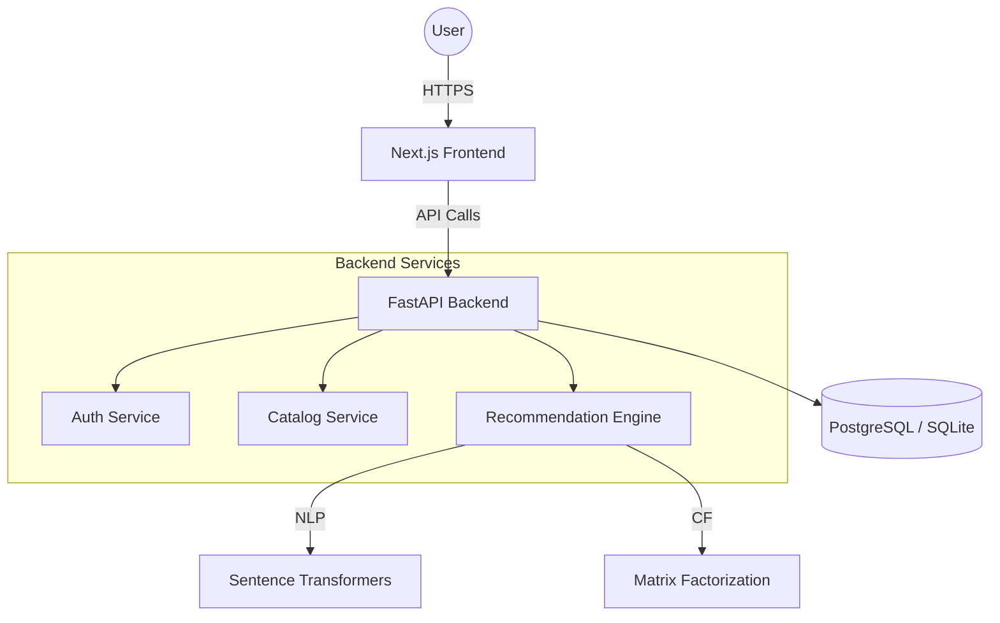

# AuraStyle: Intelligent Product Recommendation Engine
## Technical Architecture & Documentation

### 🚀 Overview
AuraStyle is a production-grade e-commerce recommendation system utilizing a **Hybrid Recommender Engine**. It combines Natural Language Processing (NLP) for content similarity, Matrix Factorization for collaborative filtering, and real-time interaction tracking to provide high-quality personalized experiences.

---

### 🏛 System Architecture

### 🧠 Recommendation Engine Details
1. **Content-Based Filtering**:
   - Uses `all-MiniLM-L6-v2` transformer model to convert product metadata into 384-dimensional embeddings.
   - Computes **Cosine Similarity** between product vectors.
2. **Collaborative Filtering**:
   - Implements **Singular Value Decomposition (SVD)** via `scipy.sparse.linalg`.
   - Predicts user-item ratings based on historical interaction weights (View=1, Cart=3, Purchase=5).
3. **Hybrid Scoring**:
   - Weighted average formula: 
     `Final Score = (Wc * Content) + (Wcf * Collaborative) + (Wp * Popularity)`

---

### 📊 Database Schema
- **Users**: Auth credentials, profile settings, preferences.
- **Products**: metadata, categories, tags, price, performance metrics.
- **Interactions**: Immutable log of user behavior (events, timestamps, weights).

---

### 🛡 Production Readiness
- **Security**: JWT-based stateless authentication.
- **Performance**: Normalized weighted scoring for real-time inference.
- **Scalability**: Decoupled ML engine from API logic, allowing for separate scaling.
- **Observability**: Structured logging for model training and API health.
